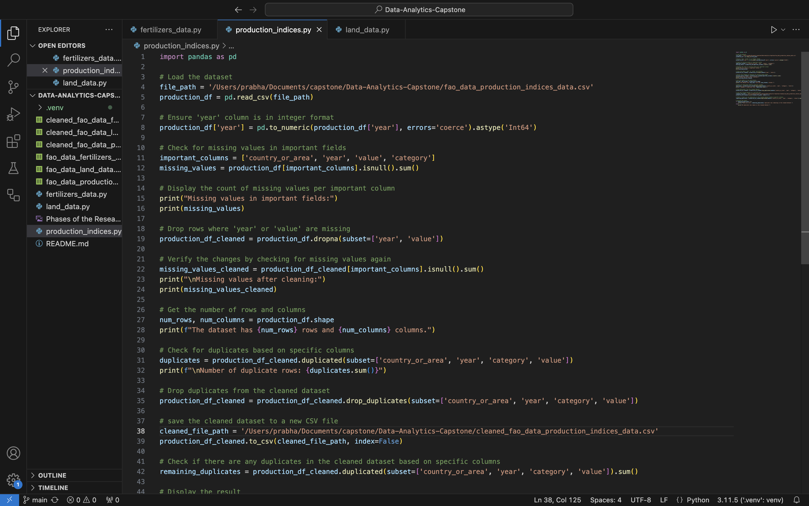
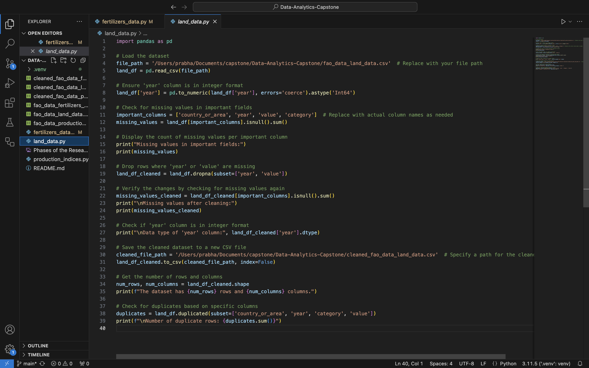
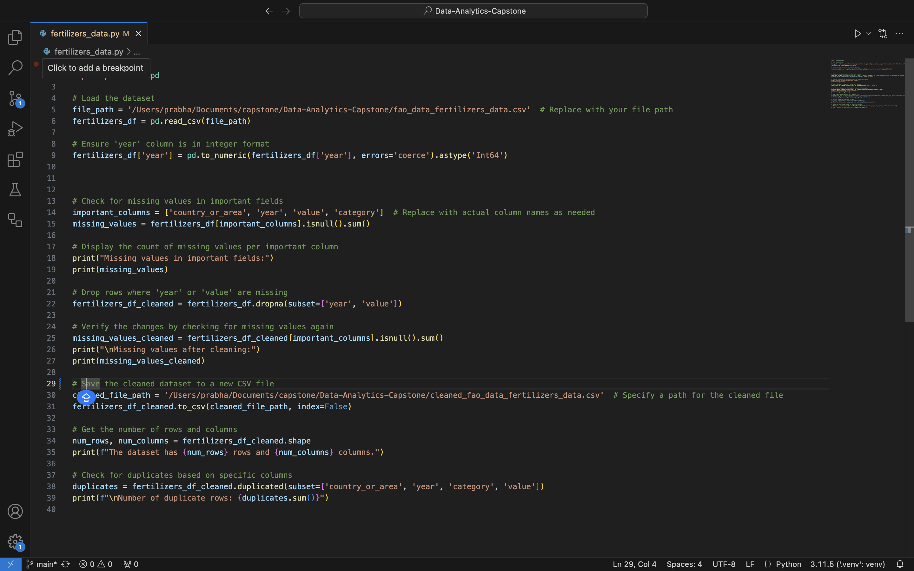
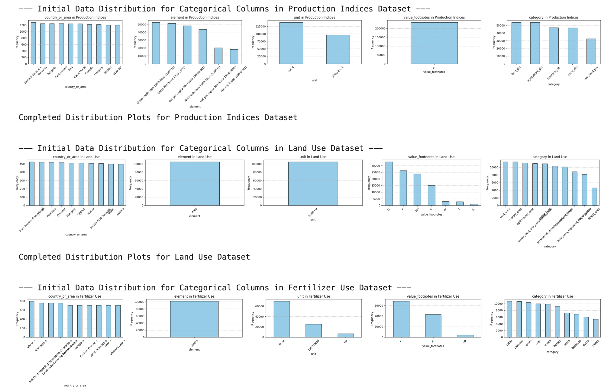
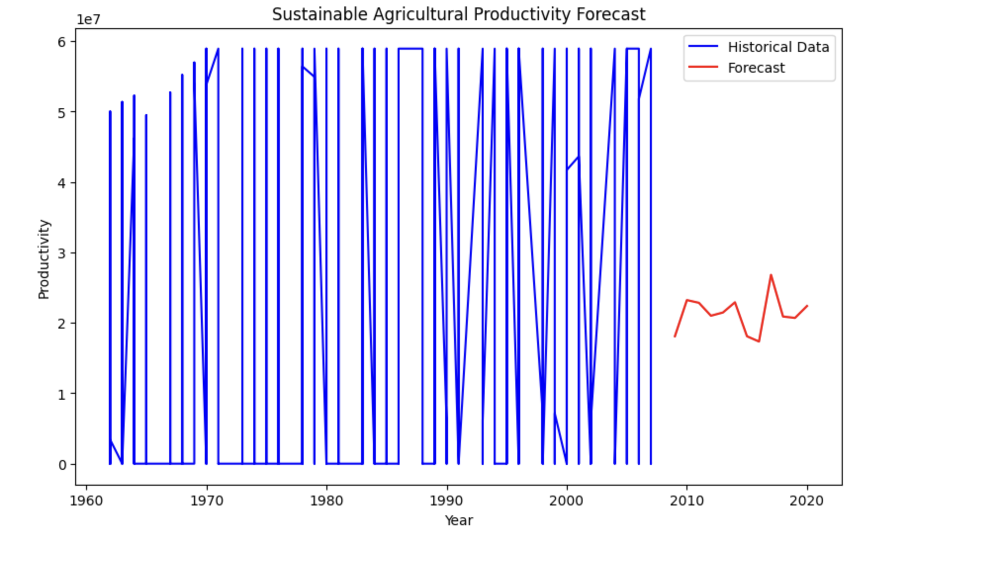

# Data-Analytics-Capstone

# Machine Learning for Sustainable Agriculture: Optimizing Land Use and Farm Inputs to Enhance Productivity and Sustainability
* Author: Prabha Sapkota
* GitHub: https://github.com/prabhasapkota/Data-Analytics-Capstone
* Overleaf: https://www.overleaf.com/project/671945ef3b8ceee7ec59c2e3

# Goals of the Research:
The goal of this research is to leverage machine learning techniques on Global Food and Agricultural Statistics datasets to uncover insights into fertilizer application, land management and aiming to optimize agricultural productivity while promoting sustainable resource use and minimizing environmental impact.
* Optimize Farm Input Usage Based on Observed Productivity Patterns.
* Identify Sustainable Land Use Practices Through Historical Data Trends.
* Forecast Sustainable Agricultural Productivity Using Machine Learning.

# Phases of the Research

# Getting Started
* Begin by creating a folder to house your information.
* This folder should contain all data that was found and will eventually be where you store the notebook.
* For organizational purposes, all data has been stored in the Data folder.
* After getting the data and performing cleaning operations, create a virtual environment within your repository.
* Type python -m venv .venv in your terminal to setup a virtual environment.
* To activate the virtual environment type .venv\Scripts\activate in the terminal.
* After creating the virtual environment use pip install -r requirements.txt in the terminal.
* Once there, type jupyter lab in the terminal. If a browser does not automatically pop up, use CTRL + Click on the link provided.

# Data Collection 
Data was downloaded directly from Kaggle Datasets in csv format. You can find the original datasets here http://data.un.org/Explorer.aspx. The datasets are downloaded directly from Kaggle in csv format. Each file has a table format with rows and columns where each row represents a unique record and each column represents a different data attribute (e.g., country, year, element, value). After that, datatsets are uploaded in the VS Code and then pushed to GitHub repository. 

# Data Source:
1. https://www.kaggle.com/datasets/unitednations/global-food-agriculture-statistics?select=fao_data_fertilizers_data.csv
2. https://www.kaggle.com/datasets/unitednations/global-food-agriculture-statistics?select=fao_data_land_data.csv
3. https://www.kaggle.com/datasets/unitednations/global-food-agriculture-statistics?select=fao_data_production_indices_data.csv

# Data Cleaning
Data cleaning is a crucial step before any analysis. Three datasets i.e. Population indices, land and fertilizer had missing values in critical fields such year and value. I used the dropna() method in pandas to remove rows of missing data. The value field is numerical and central to analysis for these three datasets, while year is essential for any temporal trends. The missing data could result in incomplete or misleading analysis, so it’s better to exclude them. The python script in vscode was used to find and remove the missing values. In addition to this, the year column is  set to an integer format across all datasets. The python script were ran to check for duplicates which were found only for production datasets and then dropped. After handling the missing values, checking integer format and identifying and dropping duplicates, the  cleaned datasets has been saved separately as you can see in github repository {https://github.com/prabhasapkota/Data-Analytics-Capstone}. 

# Data attributes and records
After the cleaning process the three datasets has following rows and columns:
* Fertilizers datasets: 102124 rows and 8 columns
* Land datasets: 104659 rows and 8 columns
* Production datasets: 311634 rows and 8 columns

# Exploratory Data Analysis
The exploratory data analysis (EDA) for this project was done in Jupyter Notebook within vscode, accessible at {http://localhost:8888/lab/workspaces/auto-V/tree/capstone.ipynb}. The cleaned datasets were uploaded to the notebook, and the following steps were performed.

## Initial Data Inspection
The initial data inspection was conducted to quickly understand the structure , contents and quality of each dataset. For this  each dataset was loaded, checked the first few rows (\verb|head()|), data types, and column names, Assessed the dataset dimensions (number of rows and columns) to get a sense of the dataset size and Identified missing values in each column and calculated missing value counts to understand potential data quality issues. 

## Initial Descriptive Statistics 
For second step descriptive statistics was calculated such as mean, median, minimum, maximum, and standard deviation for each dataset’s numerical columns (\verb|value|, representing production indices, land area, or fertilizer quantity).
Summarized count, unique, top, and frequency values for categorical columns (country or area, category and element) to understand their variability and most common entries. 

## Initial Data Distribution for Numerical Columns
The objective was to assess the spread and shape of numerical data to identify trends, potential outliers, and skewness. For this histograms were generated for numerical columns in each dataset to visualize data distributions. 

## Initial Data Distribution for Categorical Columns
Histograms were generated for numerical columns in each dataset to visualize data distributions.

## Initial Data Preparation or Data Pre-processing
Data types were converted where needed, especially ensuring the year column was an integer for each dataset. Missing values were handled by imputing average values or dropping rows where critical values were missing. Duplicate rows were identified and removed to maintain data quality, particularly in the production indices dataset where duplicates were found.

## Initial Storytelling and Presentation
The initial EDA across the three datasets provided critical insights into trends, patterns, and distributions. 
* Production Indices
The data indicates variability in agricultural production indices across different countries and years. Categories such as "Crops" and "Livestock" showed distinct trends over time. Top-producing countries demonstrate consistent growth, but variability exists in smaller economies.

* Land Use
The majority of land use categories, such as "Agricultural Land" and "Forest Land," display clear regional patterns. The relationship between land use categories and production indices suggests opportunities to optimize land utilization. Temporal trends reveal shifts in land use patterns, potentially linked to policy changes or climate factors.

* Fertilizer Use
Fertilizer use varies significantly by country and category. Nitrogen-based fertilizers dominate usage in most regions.
There’s a noticeable increase in fertilizer usage in emerging economies over the analyzed period, potentially driving productivity gains. Outlier analysis identified certain countries with extreme levels of fertilizer application, warranting further investigation.

* Visual Presentation Highlights:
The EDA was supported by impactful visualizations that reveal the underlying structure of the data.
* Line Plots
Time-series visualizations of fertilizer usage and production indices showcased trends and seasonality. Adjustments to x-axis ticks ensured clarity for datasets with extensive temporal data.
* Bar Charts
Categorical distributions revealed the dominance of specific categories, such as "Crops" in production indices and "Agricultural Land" in land use.
* Box Plots
Insights into variations across countries highlighted disparities in land use efficiency, fertilizer application, and production capabilities.
* Story Telling
The findings from the EDA were contextualized within the broader narrative of sustainable agriculture: 
Patterns in land use and fertilizer application point to opportunities for policy interventions to minimize waste and improve sustainability.
Temporal trends highlight the impact of global efforts to enhance agricultural efficiency through technological advancements and resource management.

## Predictive Analysis
Predictive Analysis was carried out by performing following steps:
1. Load and Inspect the Data

2. Merge Datasets

3. Feature Engineering 

4. Train-Test Split

### Goal 1: Optimize Farm Input Usage
Used a regression model to predict productivity based on fertilizer and land use.
Prior to use a regresison model merged datasets was checked for NaN or infinite values, and NaNs were filled with the median value of each column. Then values were clipped to a reasonable range to address any outliers or excessively large values that could distort the model's learning process. This clipping ensured that extreme values did not overly influence the model while retaining meaningful data followed by checking for Large Numerical values. After preprocessing, a regression model was trained to predict agricultural productivity (value-prod) using features such as fertilizer use, land use, and engineered variables like lagged productivity and interaction terms. The performance of the model was assessed using Mean Absolute Error (MAE) and R-squared (R²). The MAE of 102,387.80, means the model’s predictions are usually close to actual values, especially when productivity is high. The R² value of 0.99 shows the model explains 99\% of the changes in productivity, meaning it fits the data very well. This high R² suggests the model accurately shows how farm inputs (like fertilizer and land use) effect agricultural output.

### Goal 2: Identify Sustainable Land Use Practices
The main idea was to classify the land use practices as 'sustainable' and 'unsustainable'. The first step taken was to identify and remove the NaN values. The model was trained using Random Forest classifier. the model initially showed a high accuracy score, which raised concerns about potential overfitting. 

To address this and improve the model’s generalization ability, several steps were taken, Duplicate records were identified in both the training and test sets, which can introduce bias and affect model training. Removing these duplicates ensures that the model is trained on unique, relevant data. After handling the duplicates, the model was re-trained, and its performance was evaluated again. After removing duplicates and retraining the model, the accuracy reduced to a more realistic \textbf{0.52}. The model performed better at identifying unsustainable practices than sustainable ones, as seen in the classification report. The cross-validation scores showed slight fluctuations but remained consistent, suggesting the model’s performance is stable.

### Goal 3: Forecast Sustainable Agriculture Productivity
To forecast sustainability for goal 3, the process began by preparing the dataset, ensuring the year column was converted to a datetime format for time-series modeling. The next step involved building a time-series forecasting model using historical productivity data. The model was optimized using the L-BFGS-B method, a widely used optimization technique for unconstrained problems, which minimized the loss function and fine-tuned the model parameters. After optimization, the historical and forecasted productivity values were plotted, with historical data shown in blue and forecasted data in red, to visually display the predictions over time. The forecast results were provided as predicted values for future years, offering insights into potential trends in agricultural productivity. 

## Visualization
Using graphs to present numbers is a great way to tell a story with data. Data visualizations make large or small sets of information easier for the human brain to understand and interpret.
* Heatmap for Goal 1:The heatmap revealed the relationships between key variables like fertilizer use, land use, and productivity. Strong correlations were observed between land use and productivity, indicating land utilization significantly impacts productivity. Similarly, the interaction between fertilizer use and land use showed moderate correlations, highlighting their combined effect on agricultural outcomes.

* Histogram of Land Productivity for Goal 2:
The histogram compared the distribution of land productivity for "sustainable" and "unsustainable" classifications. This visualization highlights the productivity gap between the two classifications and underscores the importance of sustainable practices.

* Time-Series Line Plot for Productivity Forecast for Goal 3:
The time-series plot displayed historical productivity trends alongside forecasted values for the next 10 years. The historical data showed consistent growth in agricultural productivity, while the forecast projected a continued upward trend. The clear distinction between historical (blue line) and forecasted (red dashed line) values provides actionable insights for planning sustainable agricultural practices and policymaking.

## Conclusion
1. Optimize Farm Input Usage based on productivity patterns
Analysis revealed efficient use of fertilizers and land significantly improves productivity, indicating that efficient land management significantly impacts output. However, overuse can lead to diminishing returns and environmental harm, emphasizing the need for optimized resource allocation.
2. Identify Sustainable Land Use Practices Through Historical Data Trends
Historical data revealed significant differences in land use efficiency across regions. Categorizing practices as "sustainable" or "unsustainable" showed that sustainable methods tend to deliver higher long-term productivity and environmental advantages. However, the Random Forest classifier's moderate accuracy indicates a need for further improvement to ensure the model's applicability across diverse regions.
3. Forecast Sustainable Agricultural Productivity Using Machine Learning
The historical data showed notable inconsistencies, including missing values and extreme fluctuations, which likely impacted the model’s accuracy and reliability. Despite these issues, the time-series forecasting model indicated a steady upward trend in productivity, offering a general outlook on future performance. However, the dependency on incomplete and noisy data highlights the critical need for improved data collection and pre-processing to enhance forecast accuracy and practical applicability.

## Limitation:
The models used for the FAO datasets provided helpful insights, but they also had some limitations. First, the data had missing or zero values for important variables like land use, fertilizer use, and productivity. This meant that we had to either fill in or remove these values, which could affect the accuracy of the model. The way we created new features, such as land productivity and fertilizer efficiency, might have simplified the problem too much, not considering other factors like weather or soil quality that can affect farming outcomes.

The linear regression model used for forecasting assumes that the data follows a straight-line trend, but this might not always be true in agriculture, where trends can change in more complex ways. Also, the sustainability classification models used fixed thresholds, which may not work well in all regions with different farming practices.

The models showed high accuracy, which could mean they fit the training data very well but may not perform as effectively with new, unseen data (a problem known as overfitting). Also, important factors like climate data, crop types, and socio-economic conditions were not included, which could have made the models more accurate and helpful. Finally, the time-series forecasts relied on the historical data with notable inconsistencies which likely impacted the model’s accuracy and reliability. 

## Future Work
Future investigation in Machine Learning for Sustainable Agriculture could focus on several areas. First, exploring how machine learning can help optimize land use by predicting the best ways to manage land for both productivity and sustainability. Next, studying how machine learning can improve farm input usage, such as fertilizers and water, to reduce waste and increase efficiency. Additionally, investigating how predictive models can help forecast crop yields and identify optimal farming practices based on weather patterns. Finally, exploring how machine learning can support real time decision making by analyzing data from sensors and satellites to monitor soil health, crop growth, and environmental conditions.

## References
1. https://www.nwmissouri.edu/login/
2. Aggarwal, D., Bali, V., Mittal, S.: An insight into machine learning techniques
for predictive analysis and feature selection. International Journal of Innovative
Technology and Exploring Engineering 8(9), 342–349 (2019)
3. Ara´ujo, S.O., Peres, R.S., Ramalho, J.C., Lidon, F., Barata, J.: Machine learn-
ing applications in agriculture: current trends, challenges, and future perspectives.
Agronomy 13(12), 2976 (2023)
4. Chatfield, C.: Exploratory data analysis. European journal of operational research
23(1), 5–13 (1986)
5. Data, M.C., Komorowski, M., Marshall, D.C., Salciccioli, J.D., Crutain, Y.: Ex-
ploratory data analysis. Secondary analysis of electronic health records pp. 185–203
(2016)
6. El-Kenawy, E.S.M., Alhussan, A.A., Khodadadi, N., Mirjalili, S., Eid, M.M.: Pre-
dicting potato crop yield with machine learning and deep learning for sustainable
agriculture. Potato Research pp. 1–34 (2024)
7. Islam, M., Jin, S.: An overview of data visualization. In: 2019 International Confer-
ence on Information Science and Communications Technologies (ICISCT). pp. 1–7.
IEEE (2019)
8. kaggle: Global food and agricultural statistics, https://www.kaggle.com/
datasets/unitednations/global-food-agriculture-statistics/data?
select=fao_data_production_indices_data.csv
9. kaggle: Global food and agricultural statistics, https://www.kaggle.com/
datasets/unitednations/global-food-agriculture-statistics?select=fao_
data_fertilizers_data.csv
10. kaggle: Global food and agricultural statistics, https://www.kaggle.com/
datasets/unitednations/global-food-agriculture-statistics?select=fao_
data_land_data.csv